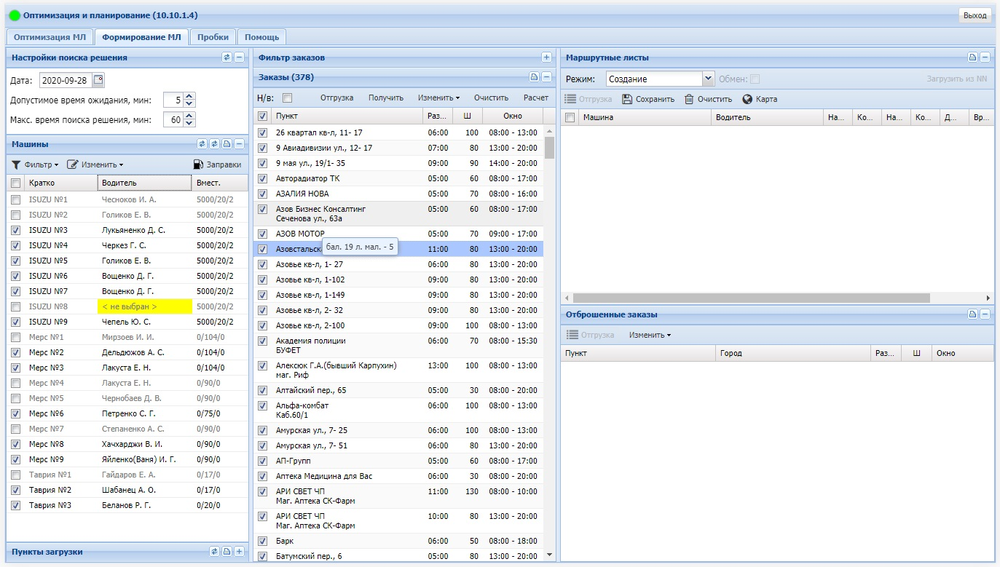

# gps_opt
Веб-интерфейс модуля оптимизации и планирования маршрутных листов службы доставки питьевой воды.

Оптимизация существующего маршрута

Формирование маршрутов из списка заказов

### Модуль "Оптимизация и планирование маршрутов".
Состоит из:
- сервер маршрутизации (прокладывание маршрутов между точками на карте) - стандартный локальный сервер OSRM;
- веб-интерфейс подготовки данных и отображения результата (этот модуль);
- [сервер обработки данных](https://github.com/murr999888/VRP).

### Назначение:
Модуль формирует маршруты транспортных средств, пытаясь минимальным количеством машин закрыть максимальное количество заказов при минимально возможной длине поездки и максимально возможной загрузке машины, с учетом рабочего времени машины, окна времени доставки груза клиенту, времени работы депо (исходного пункта выезда и возврата) и ограничений вместимости транспортного средства в разрезе видов товаров.

Перечисленные ограничения почти все являются взаимоисключающими, поэтому программа ищет наиболее оптимальный и сбалансированный вариант распределения заказов.

## Технические требования.

Учетная система: любая CRM, в которой ведется учет клиентов, вносятся заказы и формируются маршрутные листы, способная предоставлять данные установленной структуры в формате JSON по http-запросам.

Сервер маршрутизации: выделенный физический или виртуальный сервер под управлением Ubuntu 18, процессор с тактовой частотой не менее 2 ГГц (кэш L3 не менее 2 Мб), количество ядер не менее 2-х, память не менее 4Гб. 

Веб-интерфейс: рекомендуется использовать браузер Chrome или Firefox. Разрешение экрана не менее 1366x768 px. Рекомендуется разрешение 1920х1080 px.

Сервер обработки данных: выделенный физический или виртуальный сервер, процессор с максимально возможной тактовой частотой (не менее 3 ГГц), количество ядер не менее 2-х, и максимально быстрая память (DDR4 с рабочей частотой не менее 2133 МГц) и объемом не менее 4Гб, под управлением MS Windows и установленным .NET Framework 4.6.1. Поскольку расчет в режиме "Создание" или "Дополнение" на 100%  использует одно ядро процессора, то практически количество ядер процессора определяет максимальное количество параллельно запущенных процессов расчета.

## Требования к организации подготовки данных, порядку приема заказов и движению машины по маршруту.

Планирование маршрутов в данном контексте предполагает составление маршрутов до того, как машина выйдет на маршрут.

Поэтому использование программы имеет смысл при выполнении следующих условий :

Заказы принимаются сегодня на завтра. В крайнем случае - сегодня исполнением на вторую половину дня. 

- "Запас на машину" и выполнение заказов из "запаса" - исключаются. Несоблюдение маршрута, временного графика (времени приезда, разгрузки, выезда), изменение порядка следования машины от точки к точке, делает планирование бессмысленным.

- Количество внесененного в заказ товара должно соответствовать реальной отгрузке. По крайней мере быть максимально приближенной к ней.

- Ожидание машиной заказчика произвольное количество времени - исключается. Клиента можно достаточно точно проинформировать о времени прибытия машины.

- Заказы "сюда в первую очередь", "на обратном пути" - не реализуемы, и поэтому не допускаются.

- Использование "шаблонов" маршрутного листа или замена машины в маршрутном листе - не допускается. Заказы распределяются по фактическим характеристикам машин (вместимость машины в разрезе видов груза, допустимость машины для клиента и т.п.).

- Машина должна выехать на маршрут в указанное расчетное время. Поэтому она должна быть подготовлена к поездке (отремонтирована, заправлена) **ЗАРАНЕЕ**.

- Машины движутся по маршруту максимально придерживаясь расчетного времени, очередности посещения клиентов и времени, отведенного на разгрузку.
Каждой точке фактической разгрузки должен соответствовать один заказ. Отгрузка одним заказом в несколько мест на карте (по крайней мере имеющих значительное удаление друг от друга) - не допускается. 

## Что возможно получить в итоге:
- Оптимальные маршруты доставки груза, что может привести к снижению совокупного пробега машин (**до 25-30%**);
- Расчетное время выезда и возврата каждой машины.
- Расчетное время посещения каждого клиента.
- Оптимальный режим работы машины и водителя.

## Что нельзя получить на данный момент:
- Прогноз количества машин, необходимых для развоза заказов.
- Предпочтительное окно времени доставки для принимаемых в данный момент заказов.

vladislav.kostenko@gmail.com
